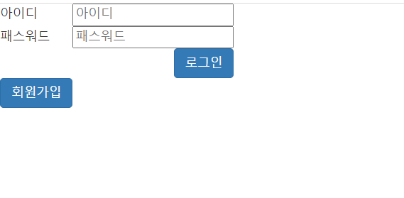
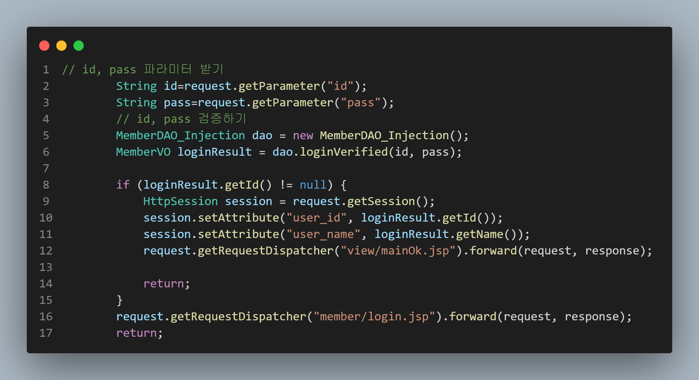
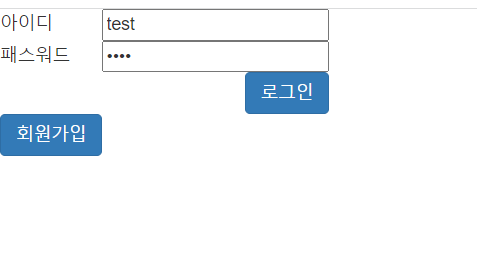
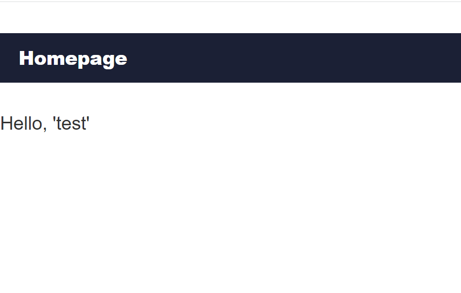
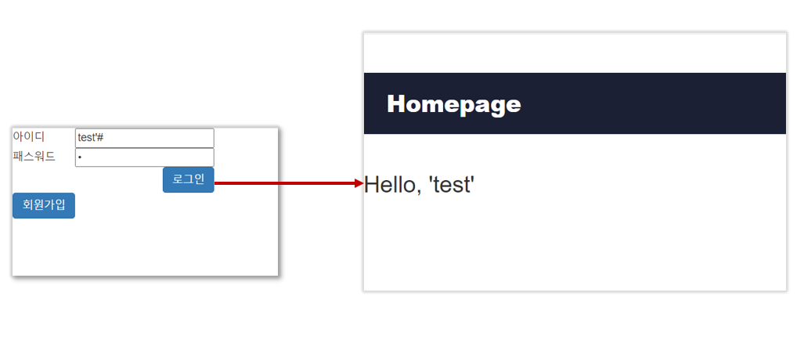
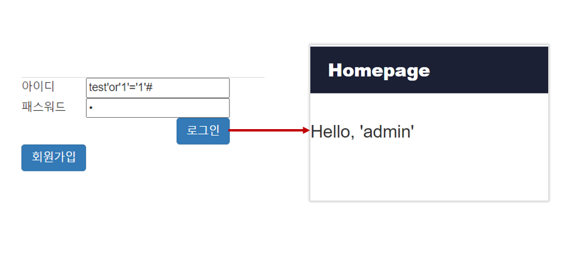
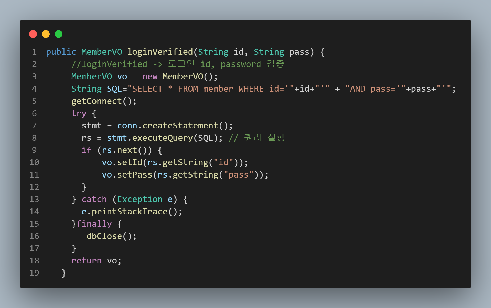

# 목차
[1. SQL Injection 이란?](2023-09-17-Injection.md#1-SQL-Injection-이란)<br>
[1.1 공격 목적](2023-09-17-Injection.md#1.1-공격-목적)<br>
[1.2 실습](2023-09-17-Injection.md#1.2-실습)<br>
[1.3 어째서 SQL Injection 공격이 성립하는 것일까?](2023-09-17-Injection.md#1.3-어째서-SQL-Injection-공격이-성립하는-것일까)


# 1. SQL Injection 이란?

> SQL Injection은 `사용자의 입력값이 서버측에서 코드로 실행`되는 '코드 인젝션' 공격 기법 중 하나이며, 서버의 DB를 대상으로 하는 공격이다.

<br>

## 1.1 공격 목적
SQL Injection은 사용자의 입력값이 SQL 쿼리문에 영향을 주어 쿼리의 의미가 변경되고 의도하지 않은 데이터의 유출 및 변조가 가능하다.
1. 정보 유출
2. 저장된 데이터 유출 및 조작
3. 원격 코드 실행
4. 인증 우회

<br>

## 1.2 실습

> 코드 상에서 SQL Injection 취약점이 발생하는 원인을 분석하고 대응해보는 실습을 진행한다.

<br>


              [그림 1] 로그인 페이지
<br>

[그림1]은 모의해킹 실습을 위해 로그인 기능을 구현한 테스트 페이지 입니다.

<br>


              [그림 2] 로그인 입력값 처리 코드
<br>

[그림1]에서의 입력값을 받아서 데이터 처리 모델(DAO)로 보내 ID와 PW를 검증하는 과정을 거치게됩니다.

<br>

검증과정을 잘 통과하면 로그인한 사용자의 세션을 생성하고, 검증에 실패한다면 다시 로그인 페이지로 리다이렉트 되는 코드입니다.

<br>


              [그림3] 테스트 계정 로그인 시도
<br>

미리 만들어 둔 테스트 계정으로 로그인을 해보았습니다.

<br>

              [그림4] 테스트 계정으로 로그인 된 화면

<br>

로그인 기능이 잘 동작하는 모습입니다.

<br> 
실습을 위해 admin 계정도 미리 만들어 두었고, 이제부터 SQL Injection 테스트를 해 볼 것 입니다.

              [그림5] sql injection 테스트
<br>

[그림 5]는 id에 "test'#"와 pw에 "1" 을 입력했고, test 계정으로 로그인이 되었습니다.

<br>

              [그림6] sql injection 테스트 2
<br>

[그림 6]은 id에 "test'or'1'='1'#" 와 pw에 "1"을 입력했더니 admin 계정으로 로그인 되었습니다.

<br></br>

## 1.3 어째서 SQL Injection 공격이 성립하는 것일까?

<br>

왜 SQL Injection 공격이 성립하였는지 데이터 처리 과정을 살펴보겠습니다.

<br>

              [그림7] DAO 코드 중 일부

[그림 7]은 [그림 2]에서 넘어오는 데이터(ID, PW)를 검증하는 코드입니다.

<br>

4번째 행을 보면 사용자가 입력하는 아이디와 패스워드가 SQL 쿼리문에 그대로 삽입되어 `입력값이 코드로 실행되기 때문에` SQL Injection 취약점이 발생하게 됩니다.

<br>

[그림 5]와 [그림 6]에서 실행되는 SQL 쿼리문의 형태를 보겠습니다.

<br>

[그림5]의 쿼리문
```sql
SELECT * FROM member WHERE id='test'# AND pass='1';
```
[그림6]의 쿼리문
```sql
SELECT * FROM member WHERE id='test'or'1'='1'# AND pass='1';
```
입력값이 코드로 실행되어 "#" 뒤에 있는 "AND pass='1';" 부분은 주석 처리가 되어 id 부분만 검증을 한다.

<br>

심지어 [그림 6]의 쿼리문은 조건이 항상 참이 되어 가장 처음에 등록해놓은 admin 계정으로 로그인이 된 것이다.

### 그 외 공격에 사용되는 쿼리문
